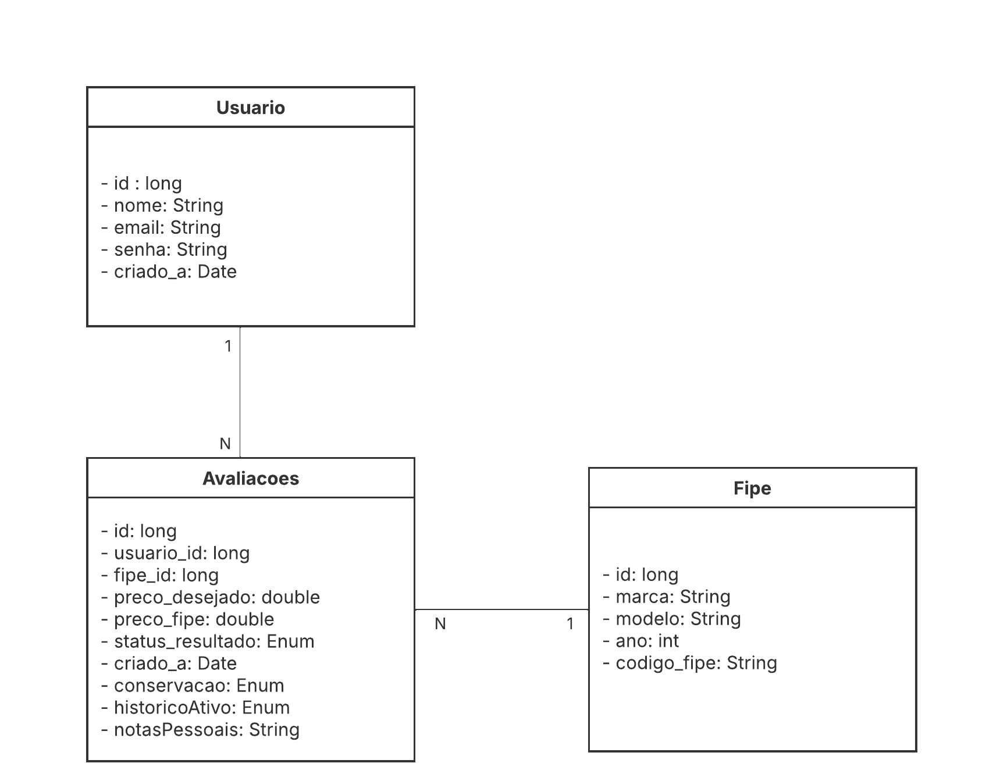

# SmartCar — Precificação Inteligente de Veículos 

## Projeto desenvolvido para a disciplina de **Projeto Integrador I**


 <h2> API REST da SmartCar — Sistema que ajuda compradores leigos a identificar se
um anúncio de veículo vale a pena. O usuário cadastra preço anunciado,
quilometragem, estado de conservação e notas pessoais; o sistema consulta o
preço FIPE e aplica um modelo heurístico próprio para classificar o negócio.
A Groq API explica ao usuário o raciocínio por trás da classificação em
linguagem acessível.  <h2> 
---

## Tecnologias 🛠️

**Backend:** Java 17 · Spring Boot 3.2  
**Banco de Dados:** MySQL · Flyway (migrations)  
**Mobile:** Kotlin · Jetpack Compose · Retrofit  
**Infra:** Docker  
**Integrações:** FIPE API (Parallelum) · Groq API

> Confira o repositorio do App: [github.com/carlosvinicyuss07/smart-car-app](https://github.com/carlosvinicyuss07/smart-car-app)

 &nbsp;  &nbsp;  &nbsp;&nbsp;&nbsp; <b><font size="5" color="#444D56">❘</font></b> &nbsp;&nbsp;&nbsp;  &nbsp;  &nbsp;  &nbsp;&nbsp;&nbsp; <b><font size="5" color="#444D56">❘</font></b> &nbsp;&nbsp;&nbsp; 

## Diagrama de Entidade-Relacionamento (DER)




---

## Estrutura do Projeto

```
src/main/java/com/glc/smartcar/
│
├── config/
│   ├── JwtAuthenticationFilter     # Intercepta requisições e valida o token JWT
│   ├── SecurityConfig              # Configuração do Spring Security e beans de auth
│   └── TokenProvider               # Geração e validação de tokens JWT
│
├── core/
│   ├── auth/
│   │   ├── AuthController          # POST /auth/cadastrar e /auth/login
│   │   ├── AuthService             # Lógica de cadastro e login
│   │   └── dto/
│   │       ├── AuthRegisterRequest
│   │       ├── AuthRegisterResponse
│   │       ├── AuthLoginRequest
│   │       └── AuthLoginResponse
│   │
│   ├── avaliacoes/
│   │   ├── AvaliacoesController    # POST /sc, PATCH /sc/{id}, GET /sc
│   │   ├── AvaliacoesService       # Orquestra FIPE + classificação + IA
│   │   ├── AvaliacoesMapper        # Conversão entre entidade e DTOs
│   │   ├── AvaliacoesRepository    # Queries JPA
│   │   ├── ClassificacaoService    # Calcula preço justo e classifica o negócio
│   │   ├── Avaliacoes              # Entidade JPA
│   │   └── dto/
│   │       ├── AvaliacaoRequestDTO
│   │       └── AvaliacaoResponseDTO
│   │
│   └── user/
│       ├── Usuario                 # Entidade JPA + UserDetails
│       ├── UserDetailsImpl         # Carrega usuário pelo email
│       ├── UserRepository          # findByEmail, existsByEmail
│       ├── UsuarioMapper
│       ├── UsuarioService
│       └── UserRoleEnum            # USER, ADMIN
│
└── integration/
    ├── fipe/
    │   ├── FipeController
    │   ├── FipeAdapter
    │   ├── FipeClient
    │   └── port/FipePort
    │
    └── ia/
        ├── IaAdapter
        ├── IaClient
        └── port/IaPort
```

---

## Endpoints

### Auth — público

| Método | Rota | Descrição |
|--------|------|-----------|
| POST | `/auth/cadastrar` | Cadastra novo usuário |
| POST | `/auth/login` | Retorna token JWT |

### Avaliações — requer token

| Método | Rota | Descrição |
|--------|------|-----------|
| POST | `/sc` | Cria avaliação de veículo |
| GET | `/sc` | Lista avaliações ativas do usuário |
| PATCH | `/sc/{id}` | Desativa avaliação (soft delete) |

### FIPE — requer token

| Método | Rota | Descrição |
|--------|------|-----------|
| GET | `/fipe` | Lista marcas |
| GET | `/fipe/marcas/{brandId}/modelos` | Lista modelos da marca |
| GET | `/fipe/marcas/{brandId}/modelos/{modelId}/anos` | Lista anos do modelo |
| GET | `/fipe/marcas/{brandId}/modelos/{modelId}/anos/{yearId}` | Retorna preço FIPE |

---

## Lógica de Classificação

O **preço justo** é calculado a partir do preço FIPE ajustado por dois fatores:

- **Quilometragem:** decaimento exponencial — acima de 14.000 km/ano penaliza, abaixo bonifica (intervalo: −40% a +15%)
- **Conservação:** impacto moderado no preço (intervalo: −20% a +20%)

| Status | Critério |
|--------|----------|
| `OTIMO_NEGOCIO` | Preço anunciado ≤ 90% do preço justo |
| `NA_MEDIA` | 90% — 105% |
| `ACIMA_DA_MEDIA` | 105% — 120% |
| `DIFICIL_DE_VENDER` | > 120% |

---

## Como Executar

### Variáveis de ambiente

| Variável | Descrição |
|----------|-----------|
| `JWT_KEY` | Chave secreta para assinar os tokens JWT |
| `JWT_EXPIRATION` | Expiração em ms — ex.: `86400000` (24 h) |
| `API_KEY` | Chave da Groq API |
| `SEU_USUARIO` | Usuário do banco MySQL |
| `SUA_SENHA` | Senha do banco MySQL |


